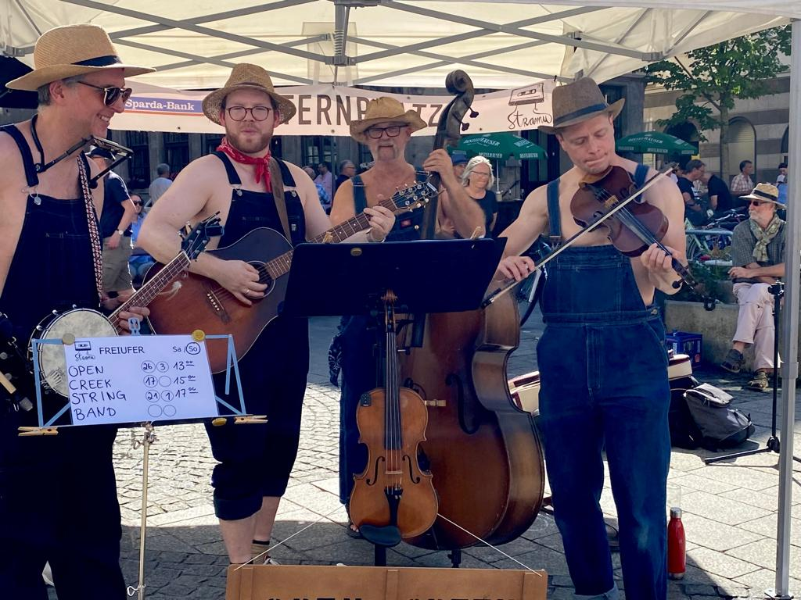

### Am Sonntag, 10. September ab 10:00

Wir spielen am Freiufer des legendären Straßenmusikfestes StraMu in Würzburg. 

[StraMu Würzburg](https://www.stramu-wuerzburg.de/programm/freiufer/)

Es hat Spaß gemacht!

- Brian (Gitarre), Jim (Geige), Javier (Banjolele) und Detlef (Kontrabass)

