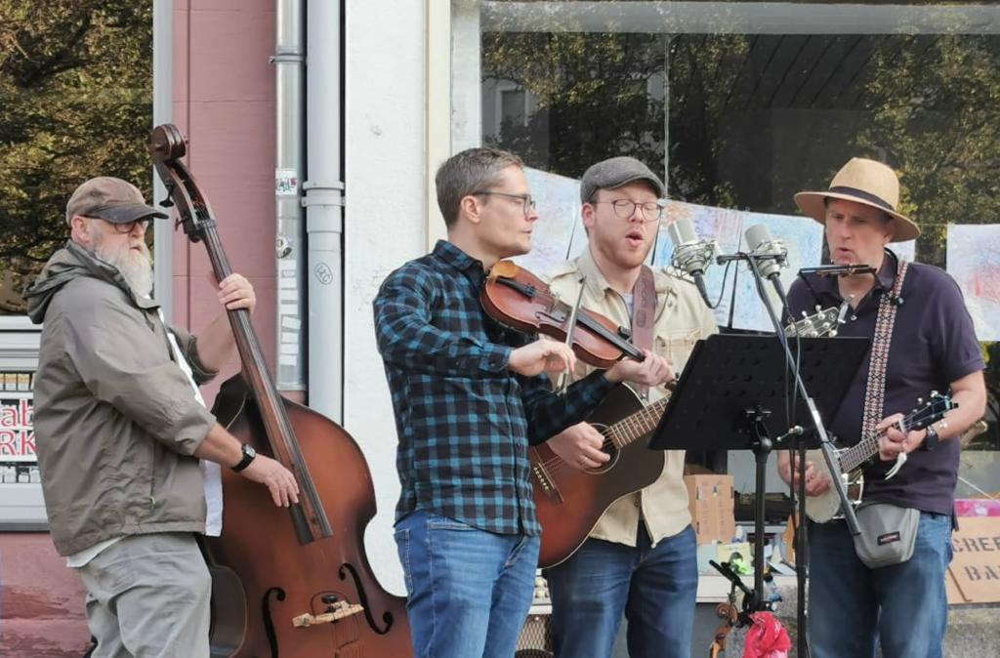

## Straßenmusikfestival Würzburg 2023
  

## Mainside Practice, August 2023
<iframe src="https://www.facebook.com/plugins/video.php?height=476&href=https%3A%2F%2Fwww.facebook.com%2Fjorg.bembelboot%2Fvideos%2F1016999379302942%2F&show_text=false&width=267&t=0" width="267" height="476" style="border:none;overflow:hidden" scrolling="no" frameborder="0" allowfullscreen="true" allow="autoplay; clipboard-write; encrypted-media; picture-in-picture; web-share" allowFullScreen="true"></iframe>

## Après Midi OF Mathildenplatz, Juni 2023

## Riverside Jam April 2023

## Jam Sesh Late November 2022
<video src="/assets/img/choochoo.mp4" autoplay muted controls loop width="100%"></video>

## Jam Sesh Early November 2022
<video src="/assets/img/oceanwaves.mp4" autoplay muted controls loop width="100%"></video>

## Riverside Hoe-Down 2022
<video src="/assets/img/tannersFarm.mp4" autoplay muted controls loop width="100%"></video>

## Mathildenplatzfest 2022
<video src="/assets/img/boilthemcabbage.mp4" autoplay controls muted loop width="100%"></video>

